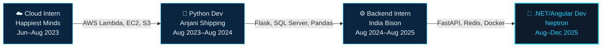

<div align="center">


<br/>

[](https://www.linkedin.com/in/prathamesh-shivale-5b074a230/)
[](https://prathameshshivale.lovable.app)
[](mailto:pshivale21@gmail.com)
[](https://wa.me/918169703820)

<br/>


</div>

<br/>

<!-- ═══════════════════════════════════════════════════════════════ -->
<!-- ABOUT ME -->
<!-- ═══════════════════════════════════════════════════════════════ -->

##  &nbsp;Who Am I

<table>
<tr>
<td width="55%" valign="top">

```yaml
name: Prathamesh Shivale
location: Navi Mumbai, India
role: Backend & AI/ML Engineer

what_drives_me: >
  I don't build for demos —
  I build for production.
  If it can't handle real data,
  real users, or real markets,
  it's not done yet.

right_now:
  shipping: NSE algo system (live paper trading)
  exploring: MCP protocol & agentic AI
  learning: market microstructure

open_to:
  - Remote / Full-time positions
  - Open-source collaborations
  - Hard problems involving AI + data
```

</td>
<td width="45%" align="center" valign="top">


<br/><br/>

<picture>
  <source media="(prefers-color-scheme: dark)" srcset="https://github-readme-stats.vercel.app/api/top-langs/?username=Machi2130&layout=compact&hide_border=true&bg_color=0D1117&title_color=00D4FF&text_color=c9d1d9&langs_count=8&card_width=340">
  
</picture>

</td>
</tr>
</table>

<br/>

<!-- ═══════════════════════════════════════════════════════════════ -->
<!-- FEATURED SYSTEMS -->
<!-- ═══════════════════════════════════════════════════════════════ -->

##  &nbsp;Things I've Built

> *Each of these solves a real problem. No toy projects.*

<table>
<tr>
<td width="50%" valign="top">

### 📈 NSE Algo Trading System

<p>


</p>

Multi-strategy backtester across **139 NSE equities** over 11 years. Walk-forward validation (9 folds), ATR position sizing, rolling circuit breaker, live SSE terminal. Currently in **paper-trading on Angel One.**

<p>


</p>

<a href="https://github.com/Machi2130"></a>

</td>
<td width="50%" valign="top">

### 🗄️ HybridSQL — NL to SQL + RAG

<p>


</p>

Ask questions in English → get auditable SQL + document answers. 3-signal schema retriever, 60/40 BM25+vector DocStore, NetworkX join graphs. Ships as an **MCP server for Claude Desktop & Cursor.**

<p>


</p>

<a href="https://github.com/Machi2130"></a>

</td>
</tr>
<tr>
<td width="50%" valign="top">

### ⚖️ LegalVault — AI Legal Intelligence

<p>


</p>

Turns 10K+ Indian High Court judgments into searchable intelligence. LLM entity extraction, GPU-accelerated Jina embeddings, automated PDF pipeline, similar-case retrieval API.

<p>


</p>

<a href="https://github.com/Machi2130"></a>

</td>
<td width="50%" valign="top">

### 📋 Team Project Planner (Factwise)

<p>


</p>

Complete backend for users, teams, boards, and task workflows. Abstract base classes, clean separation of concerns, JSON persistence, extensible design.

<p>


</p>

<a href="https://github.com/Machi2130/Factwise1"></a>

</td>
</tr>
</table>

<br/>

<!-- ═══════════════════════════════════════════════════════════════ -->
<!-- TECH STACK -->
<!-- ═══════════════════════════════════════════════════════════════ -->

##  &nbsp;Tech I Work With

<div align="center">

**Languages & Frameworks**


<br/><br/>


<br/><br/>

**AI / ML**


&nbsp;&nbsp;


<br/><br/>

**Infrastructure & Data**


<br/><br/>


</div>

<br/>

<!-- ═══════════════════════════════════════════════════════════════ -->
<!-- EXPERIENCE -->
<!-- ═══════════════════════════════════════════════════════════════ -->

## 💼 Where I've Worked



<br/>

<details>
<summary><b>📄 Expand for details</b></summary>
<br/>

<table>
<tr>
<td width="12%" align="center">

</td>
<td>

**🔷 .NET / Angular Developer** @ **Neptron** · `Aug – Dec 2025`


Retail-POS full-stack · REST APIs · CI/CD

</td>
</tr>
<tr>
<td align="center">

</td>
<td>

**🔷 Backend Developer Intern** @ **India Bison** (Remote) · `Aug 2024 – Aug 2025`


E-Commerce Intelligence Platform · **65% metadata reduction** · crawl4ai

</td>
</tr>
<tr>
<td align="center">

</td>
<td>

**🔷 Python Developer** @ **Anjani Shipping Agency** · `Aug 2023 – Aug 2024`


Import/Export Management · CKAN trade data

</td>
</tr>
<tr>
<td align="center">

</td>
<td>

**🔷 Cloud Development Intern** @ **Happiest Minds** · `Jun – Aug 2023`


Lambda · EC2 · S3 · API Gateway · **15% downtime reduction**

</td>
</tr>
</table>

</details>

<br/>


<!-- ═══════════════════════════════════════════════════════════════ -->
<!-- CONNECT -->
<!-- ═══════════════════════════════════════════════════════════════ -->

##  &nbsp;Let's Talk

<div align="center">

<a href="https://www.linkedin.com/in/prathamesh-shivale-5b074a230/">
  
</a>
&nbsp;
<a href="https://prathameshshivale.lovable.app">
  
</a>
&nbsp;
<a href="mailto:pshivale21@gmail.com">
  
</a>
&nbsp;
<a href="https://wa.me/918169703820">
  
</a>

<br/><br/>


<br/>

---

<sub>⚡ *"Systems that survive production are worth more than systems that survive presentations."*</sub>

</div>


